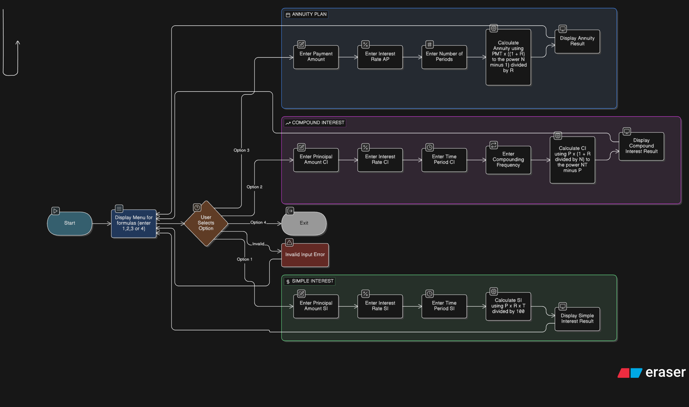

# formula calculator

## Program flowchart
 here is the flowchart of the algorithm




## what it does
the aim of the project is to create an interface to calculate:
1. simple interest
2. compound interest
3. annuity plan
 
 it would also have the feautre of indefinite loops and an option to exist
 
 ## structure 
 it uses
 functions to calculate each formula 
 a while true loop to keep it running
 an if elseif and else statement to allow us select each formula
 break statement to stop the loop

 ## phases
 display options
 loop
 accept input
 match input
 accept details
 print details
 repeat or break
 error handling

 ## display options
```python
print("1. Simple interest")
print("2. Compound interest")
print("3. Annuity")
print("4. Exit")
```
this prints the options

## loop
```python
while True:
```
 ## accepting input 
 ```python
choice = int(input("\nEnter your choice (1, 2, 3, or 4): "))
 ```

 ## match input and accept details
 ```python
 if choice == 1: #SI
        P = float(input("Enter the principal amount: "))
        R = float(input("Enter the interest rate (in %): "))
        T = float(input("Enter the time in years: "))
        SI = (P * R * T) / 100
        
    elif choice == 2: #CI
        P = float(input("Enter the principal amount: "))
        R = float(input("Enter the interest rate (in %): "))
        T = float(input("Enter the time in years: "))
        CI = P * (1 + R / 100) ** T 
        
    elif choice == 3: #A
        P = float(input("Enter the principal amount: "))
        R = float(input("Enter the interest rate (in %): "))
        T = float(input("Enter the time in years: "))
        A = P * (((1 + R / 100) ** T) - 1) / (R / 100)
        
 ```

## print details
```python
print("The Simple Interest after", T, "years is:", SI)
print("The Compound Interest after", T, "years is:", CI)
print("The Annuity after", T, "years is:", A)
#this prints for each option
```

## repeat or break
since we are using while if, it would always repeat so we set a separate option to break from the choices
```python
 elif choice == 4:
        print("Exiting the program.")
        break
```
## error handling
in the case of someone putting a different option which can create an error, we condition it to loop and point out the error
```python
else:
        print("Please enter 1, 2, 3, or 4.")
```
